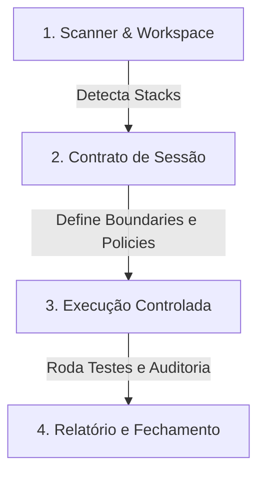

# Introdução ao kv CLI

O `kv` é um **harness de desenvolvimento assistido por IA** local-first e markdown-first, projetado para unificar o código-fonte de seus projetos com diretrizes de arquitetura, padrões organizacionais, ADRs (Architectural Decision Records) e runbooks contidos em um **Knowledge Vault** (Cofre de Conhecimento).

No paradigma clássico, agentes de IA operam sem limites claros, lendo arquivos arbitrários ou gerando códigos sem conformidade técnica. O `kv` inverte esse cenário: ele estabelece **contratos de sessão** que delimitam o escopo físico da IA, automatiza a compilação do contexto técnico relevante, executa testes de qualidade integrados e cria logs de auditoria detalhados.

---

## 🏗️ Fluxo Geral de Operação

O ecossistema do `kv` funciona em três etapas fundamentais:



1. **Workspace**: Mapeamento inicial das aplicações do repositório (`kv workspace scan`).
2. **Sessão (Session)**: Definição do escopo da tarefa, quais microsserviços serão afetados, quais runbooks serão injetados e limites físicos (boundaries).
3. **Contexto & Execução**: Compilação automática do contexto enriquecido e execução das tarefas via runners protegidos (como o **OpenCode**).

---

## 🛠️ Filosofia Local-First & Markdown-First

- **Transparência**: Todas as configurações, logs de auditoria e relatórios finais são arquivos locais em formato YAML, JSONL ou Markdown (`.kv/sessions/`).
- **Rastreabilidade**: Mudanças propostas e contextos gerados são commitados no histórico do Git junto com o código do projeto.
- **RAG Local Inteligente**: Uma interface interativa com chat cognitivo (RAG) local-first que permite interagir e validar a documentação sem vazamento de dados.

> [!NOTE]
> Para utilizar as APIs cognitivas e de compilação da LLM Wiki, certifique-se de configurar a variável de ambiente:
> ```bash
> export GEMINI_API_KEY="sua-chave-api-gemini"
> ```
