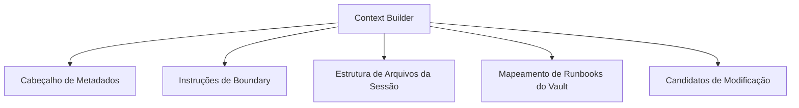

# Compilador de Contexto Enriquecido

Para que um Agente de IA consiga realizar tarefas com excelência, ele precisa de contexto estruturado. No entanto, passar o repositório inteiro é caro e confuso. O `kv` possui um **Context Builder** embarcado que compila e otimiza o contexto técnico sob medida para a sessão.

---

## ⚡ Comando de Compilação

Após configurar seu contrato em `session.yaml`, execute:

```bash
kv context build --session session-auth-refactor
```

### O que o Context Builder gera?
1. **`.kv/sessions/<session-id>/context.md`**: Um super-documento consolidando as informações da sessão para o Agente.
2. **`.kv/sessions/<session-id>/opencode.md`**: Um manifesto formatado para integração nativa com o runner do **OpenCode**.

---

## 📦 Conteúdo do Contexto Gerado

O arquivo `context.md` gerado contém seções otimizadas para consumo de LLMs:



### 1. Instruções de Boundary
Indica explicitamente quais caminhos a IA tem permissão para ler, em quais ela pode escrever, e quais arquivos são estritamente somente leitura (como os runbooks da empresa).

### 2. Estrutura do Projeto (Árvore Recursiva Limpa)
Monta uma árvore de arquivos das aplicações selecionadas. O builder filtra automaticamente diretórios pesados e desnecessários como:
- `.git`
- `node_modules`
- `dist` / `build`
- `.sass-cache`

### 3. Arquivos Candidatos por Proximidade
A IA analisa o objetivo da sessão e faz buscas lexicais para destacar arquivos do repositório que têm alta chance de precisar de modificações.

> [!IMPORTANT]
> **Profundidade Limite**: O Context Builder respeita os limites de tokens. Caso o projeto seja gigantesco, ele aplica truncamentos inteligentes baseados em relevância de arquivos e profundidade máxima de diretórios para economizar seu limite e otimizar as respostas.
