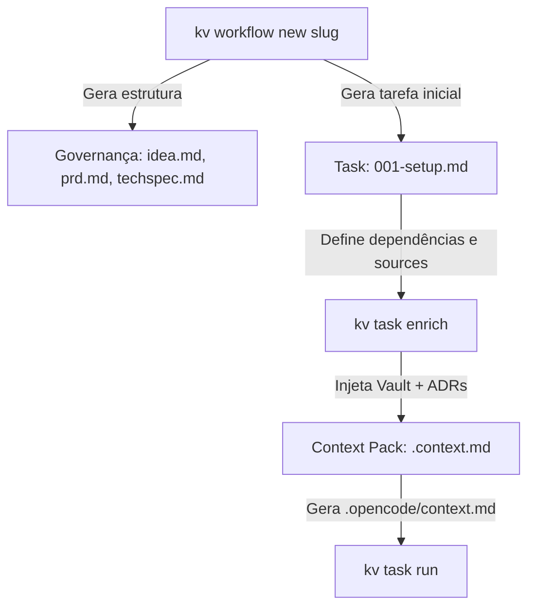

# Gerenciamento de Workflows e Tasks

Além do ciclo de vida de sessões baseadas em contratos multi-app, o `kv` fornece um fluxo de trabalho estruturado e versionável baseado em **Workflows** e **Tasks**. Esse fluxo permite dividir uma entrega complexa de engenharia em etapas incrementais e controladas por arquivos Markdown e metadados no Git.

---

## 🏗️ Conceito de Workflows e Tasks

Um **Workflow** é um fluxo de trabalho voltado a realizar um objetivo de produto ou engenharia (por exemplo, `feature-oauth` ou `bugfix-latency`). Cada workflow possui sua própria pasta contendo documentos de governança (`idea.md`, `prd.md`, `techspec.md`) e um subdiretório de tarefas (`tasks/`).

Uma **Task** é uma unidade de trabalho indivisível que possui um schema estruturado em frontmatter YAML para definir metadados operacionais para agentes de IA (como complexidade, dependências, arquivos fonte afetados e critérios de aceitação).



---

## 🔧 1. Criando um Novo Workflow

Para inicializar um novo fluxo de trabalho estruturado no workspace atual:

```bash
kv workflow new <slug>
```

### O que é gerado?
O comando cria um diretório sob `.kv/workflows/<slug>/` com as seguintes pastas e arquivos de governança:
- **`idea.md`**: Sumário executivo e proposta da solução.
- **`prd.md`**: Requisitos do produto e escopo.
- **`techspec.md`**: Especificação de arquitetura técnica e plano de validação.
- **`tasks/`**: Diretório para armazenar as tarefas.
- **`context/`**: Diretório para armazenar os pacotes de contexto compilados.
- **`reviews/`**: Registros de auditorias de código feitas por agentes.
- **`memory/`**: Memórias acumuladas durante as execuções do agente.

Também gera automaticamente a tarefa inicial: **`tasks/001-setup.md`**.

---

## 📋 2. Estrutura e Schema de uma Task

As tarefas são arquivos Markdown localizados em `.kv/workflows/<slug>/tasks/<task-id>.md`. Cada tarefa possui a estrutura abaixo:

```markdown
---
id: 002-add-login
title: "Implementar autenticação por email"
status: todo
type: feature
complexity: medium
dependencies:
  - 001-setup
agent/runner: opencode
sources:
  - internal/auth/handler.go
  - internal/auth/service.go
acceptanceCriteria:
  - "Endpoint /auth/login retorna JWT válido"
  - "Testes unitários do handler de autenticação com 100% de cobertura"
---

# Implementar autenticação por email

Descreva aqui em Markdown os detalhes da tarefa e instruções para o agente de IA.
```

### Descrição dos Campos do Frontmatter:
- **`id`**: Identificador único da tarefa (ex: `002-add-login`).
- **`title`**: Título amigável da tarefa.
- **`status`**: Estado atual (`todo`, `in-progress`, `done`). O `kv` atualiza para `in-progress` ao enriquecer.
- **`type`**: Categoria da tarefa (`feature`, `bugfix`, `refactor`, `chore`, `test`).
- **`complexity`**: Nível de esforço estimado (`low`, `medium`, `high`).
- **`dependencies`**: Lista de IDs de tarefas que devem ser finalizadas antes desta.
- **`agent/runner`**: Runner recomendado para executar esta tarefa (ex: `opencode`).
- **`sources`**: Caminhos relativos de arquivos fonte associados a esta tarefa que o runner deve ler/modificar.
- **`acceptanceCriteria`**: Lista de condições obrigatórias para que a tarefa seja dada como concluída.

---

## 🔍 3. Enriquecimento de Contexto (`kv task enrich`)

Antes de executar a tarefa, você deve compilar o contexto necessário usando:

```bash
kv task enrich <workflow-slug> <task-id>
```

### O que o enriquecimento faz?
1. Lê a tarefa correspondente e atualiza o `status` para `in-progress` (se estiver `todo` ou vazio).
2. Lê recursivamente o conteúdo dos arquivos listados em **`sources`** no frontmatter e os anexa no arquivo de contexto.
3. Se houver um **Knowledge Vault** ativo associado, realiza uma busca textual inteligente usando o título da task no cofre para resgatar runbooks e documentos relevantes.
4. Classifica e separa automaticamente decisões arquiteturais encontradas em `05-decisions` (ADRs) ou tags relacionadas a decisões.
5. Copia a seção `Validation Plan` (Plano de Validação) descrita na especificação técnica (`techspec.md`).
6. Consolida tudo em um arquivo Markdown unificado (Context Pack) salvo em:
   `.kv/workflows/<workflow-slug>/context/<task-id>.context.md`

---

## ⚡ 4. Compilando o Contexto para Execução (`kv context build`)

Para disponibilizar o pacote de contexto no local esperado pelo agente (na raiz do projeto, legível pelo harness):

```bash
kv context build <workflow-slug> <task-id>
```

Esse comando pega o Context Pack gerado na pasta do workflow e cria o arquivo compilado unificado em:
`.opencode/context.md`

*(Esse arquivo unificado serve como o ponto de entrada principal que o agente lerá ao iniciar).*

---

## 🚀 5. Executando a Task (`kv task run`)

Para disparar o agente de IA e resolver a tarefa com o runner especificado:

```bash
kv task run <workflow-slug> <task-id> [--runner <runner>]
```

### Fluxo de Execução:
1. Executa automaticamente o `kv context build` sob o capô para garantir que a última versão do contexto esteja em `.opencode/context.md`.
2. Valida a saúde do executável do runner (ex: validação com o comando local `opencode doctor`).
3. Invoca o comando do runner:
   ```bash
   opencode run "Please read the task context file at `.opencode/context.md` and complete the task instructions described there."
   ```
4. O terminal interativo é compartilhado diretamente com o processo em execução para que o agente e você possam interagir durante o desenvolvimento.
