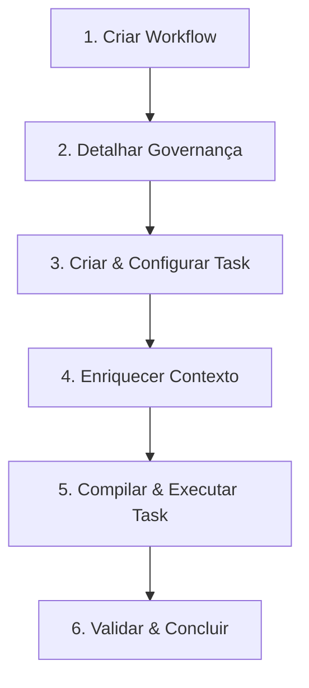

# Guia de Desenvolvimento Passo a Passo com o kv

Neste guia prático, você aprenderá a desenvolver e implementar novas funcionalidades em uma aplicação utilizando o `kv` CLI. O `kv` suporta dois fluxos de desenvolvimento principais:
1. **Desenvolvimento Baseado em Workflows & Tasks** (Recomendado para tarefas estruturadas, versionáveis e incrementais).
2. **Desenvolvimento Baseado em Sessões Multi-App** (Ideal para iterações rápidas, diretas via CLI, com foco em segurança física de boundaries).

---

## 🛠️ Método A: Fluxo de Workflows & Tasks (Estruturado & Incremental)

Este método organiza todo o seu ciclo de entrega sob a governança do repositório Git, ideal para pair-programming com agentes de IA.



### Passo 1: Inicializar o Workflow
Crie um fluxo de trabalho estruturado para a nova feature (por exemplo, adicionar um sistema de notificação por webhook):

```bash
kv workflow new feature-notifications
```

**Resultado no disco:**
O `kv` cria a pasta `.kv/workflows/feature-notifications/` com subdiretórios de suporte e arquivos de governança:
- `idea.md`, `prd.md`, `techspec.md`
- `tasks/001-setup.md` (tarefa inicial criada automaticamente)

---

### Passo 2: Detalhar a Governança (Opcional, mas Recomendado)
Abra os arquivos gerados e preencha brevemente o escopo técnico. Isso serve como âncora para a IA.
- Em `prd.md`, defina o que é a feature.
- Em `techspec.md`, adicione a seção de **Validation Plan**:
  ```markdown
  ## Validation Plan
  - O endpoint `/webhooks/notify` deve responder com status 200 OK.
  - Testes unitários do pacote de envio com 100% de cobertura.
  ```

---

### Passo 3: Criar e Configurar a Task
Crie um arquivo Markdown para a sua tarefa específica sob `.kv/workflows/feature-notifications/tasks/002-add-notification-webhook.md`.

Defina o schema frontmatter YAML e descreva a tarefa:

```markdown
---
id: 002-add-notification-webhook
title: "Implementar endpoint de webhook para notificações"
status: todo
type: feature
complexity: medium
dependencies:
  - 001-setup
agent/runner: opencode
sources:
  - internal/notification/handler.go
  - internal/notification/service.go
acceptanceCriteria:
  - "Criar o handler HTTP para receber payloads de notificação"
  - "Salvar os logs de entrega em banco de dados"
  - "Escrever testes unitários em internal/notification/handler_test.go"
---

# Implementar endpoint de webhook para notificações

Precisamos de um endpoint público `/webhooks/notify` que receba requisições POST com JSON no seguinte formato:
```json
{
  "event": "payment.success",
  "payload": {
    "id": "pay_12345",
    "amount": 15000
  }
}
```

O serviço deve processar o evento, persistir no banco e responder com HTTP 200.
```

> [!IMPORTANT]
> A propriedade **`sources`** especifica quais arquivos o agente de IA tem autorização para modificar e visualizar. Certifique-se de listar todos os arquivos necessários.

---

### Passo 4: Enriquecer a Task (`kv task enrich`)
Agora, compile as dependências de contexto, decisões arquiteturais (ADRs) e runbooks do Knowledge Vault usando:

```bash
kv task enrich feature-notifications 002-add-notification-webhook
```

**O que acontece sob o capô?**
- O `kv` lê a sua task e altera o status para `in-progress`.
- Resgata os arquivos listados em `sources`.
- Faz uma busca inteligente (RAG local) no seu **Knowledge Vault** ativo e injeta runbooks sobre webhooks e tratamento de erros.
- Cria o arquivo de contexto consolidado em `.kv/workflows/feature-notifications/context/002-add-notification-webhook.context.md`.

---

### Passo 5: Compilar e Executar a Task (`kv task run`)
Para disparar o runner e entregar o trabalho para o agente de IA:

```bash
kv task run feature-notifications 002-add-notification-webhook
```

**O que o kv faz automaticamente neste passo?**
1. Roda `kv context build` para exportar o pacote de contexto para `.opencode/context.md` na raiz do projeto.
2. Invoca o comando do runner OpenCode (`opencode run`).
3. O agente lê o arquivo `.opencode/context.md`, faz as modificações nos arquivos fontes especificados e cria os testes necessários.
4. O terminal interativo é compartilhado com você, permitindo acompanhar e aprovar mudanças em tempo real.

---

### Passo 6: Validar e Fechar a Task
Após o agente terminar, os testes unitários serão executados pelos Quality Gates.
Você poderá revisar o diff e atualizar o status da task no markdown para `done`:
```yaml
status: done
```

---

## ⚡ Método B: Fluxo de Sessões Multi-App (Direto via CLI)

Ideal para alterações rápidas focadas em objetivos específicos onde você deseja especificar as permissões e limites de boundary diretamente na linha de comando.

### Passo 1: Mapear o Workspace
Antes de criar sessões, certifique-se de que o `kv` conhece os microsserviços/pastas do seu projeto:

```bash
kv workspace scan
```
*(Isso cria ou atualiza o arquivo `kv-workspace.yaml` na raiz do repositório).*

---

### Passo 2: Inicializar a Sessão
Inicialize um contrato de sessão contendo as regras de segurança física (boundary) e o objetivo:

```bash
kv session init \
  --id session-webhook-fix \
  --goal "Corrigir formato de data no envio de webhooks" \
  --apps notifications-api=./apps/notifications-api \
  --vault ./vault/runbooks \
  --writable ./apps/notifications-api
```

**O que é gerado?**
A pasta `.kv/sessions/session-webhook-fix/` contendo o contrato declarativo `session.yaml`.

---

### Passo 3: Validar a Sessão
Garante que as regras de segurança do contrato são válidas e não expõem arquivos sensíveis:

```bash
kv session validate --session session-webhook-fix
```

---

### Passo 4: Executar um Dry Run (Simulação)
Antes de invocar a IA, visualize o tamanho do contexto e as permissões de leitura/escrita que serão passadas:

```bash
kv run --session session-webhook-fix --dry-run
```

---

### Passo 5: Executar a Sessão (`kv run`)
Dispare o runner com a sessão configurada:

```bash
kv run --session session-webhook-fix
```
A IA receberá o contexto estruturado em `.kv/sessions/session-webhook-fix/opencode.md`, executará as correções e encerrará.

---

### Passo 6: Rodar Testes de Qualidade (Quality Gates)
Valide se as alterações propostas não introduziram quebras ou bugs:

```bash
kv quality run --session session-webhook-fix
```
*(Executa o comando de teste configurado na stack, ex: `go test ./...` ou `npm test` dentro de `./apps/notifications-api`).*

---

### Passo 7: Resumir Alterações e Gerar Relatório
Finalize a sessão analisando as modificações feitas pelo agente:

```bash
# 1. Gera o resumo estruturado de diff no Git
kv diff summarize --session session-webhook-fix

# 2. Consolida o relatório técnico final da sessão
kv session report --session session-webhook-fix
```

O relatório gerado em `.kv/sessions/session-webhook-fix/report.md` conterá as validações, comandos executados, riscos detectados e alterações finais prontas para o seu Code Review!
